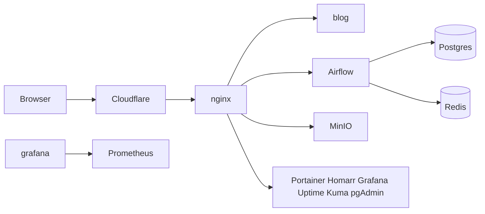

# nqtn.dev

Docker services on a VPS, with nginx as the only process on ports 80 and 443. Cloudflare proxies the domain, Let's Encrypt proves ownership through the Cloudflare DNS API, and the host firewall, fail2ban, and SSH settings sit in front of the containers.

The stacks live in [`selfhost/`](selfhost/README.md). The current step is the `nqtn` login. Networking, management, and the other containers, and their DNS names, come after that login works.

## Services



| URL | Service |
| --- | --- |
| https://nqtn.dev | Astro blog |
| https://airflow.nqtn.dev | Airflow |
| https://minio.nqtn.dev | MinIO console |
| https://s3.nqtn.dev | MinIO S3 API |
| https://pgadmin.nqtn.dev | pgAdmin |
| https://portainer.nqtn.dev | Portainer |
| https://homarr.nqtn.dev | Homarr start page |
| https://status.nqtn.dev | Uptime Kuma health checks |
| https://grafana.nqtn.dev | Grafana, fed by Prometheus |
| https://keycloak.nqtn.dev | Keycloak, started with the data stack |
| https://redisinsight.nqtn.dev | RedisInsight |
| https://komga.nqtn.dev | Komga books and comics, optional |
| https://adguard.nqtn.dev | AdGuard Home, optional |
| https://flower.nqtn.dev | Celery Flower, optional |

Postgres, Redis, Prometheus, and the node exporter have no public ports. nginx is the only published service.

Use a VPS with 2 vCPU and 4 GB of RAM when Airflow is included. Ubuntu 24.04 or Debian 12. SSH key access. The domain `nqtn.dev` on Cloudflare, using Cloudflare's nameservers.

## 1. Cloudflare

In the Cloudflare dashboard for `nqtn.dev`:

1. **DNS → Records**. Add an `A` record for `@` pointing at the VPS IPv4 address, proxy on (orange cloud). Add an `A` record for `*` with the same address, proxy on. Add an `AAAA` record for each if the VPS has IPv6. Proxied wildcards work on every Cloudflare plan.
2. **SSL/TLS → Overview**. Set the mode to **Full (strict)** after the first successful deploy. Before the origin certificate exists, Cloudflare returns error 526, which is expected.
3. **SSL/TLS → Edge Certificates**. Turn on **Always Use HTTPS** and **Automatic HTTPS Rewrites**. Set **Minimum TLS Version** to 1.2.
4. **Security → Settings**. Turn on **Bot Fight Mode**. Leave the free managed WAF ruleset enabled.
5. **My Profile → API Tokens → Create Token**. Use the **Edit zone DNS** template and limit it to `nqtn.dev`. Save it as the GitHub secret `CLOUDFLARE_API_TOKEN`. It is only for certificate issuance.
6. Copy the **Zone ID** from the domain overview page. A second token, limited to the same zone with **Zone → Firewall Services → Edit**, is used later by fail2ban.

Turn on two-factor authentication for the Cloudflare account.

## 2. Create the nqtn user

`nqtn` is the login that replaces root. It has sudo, no password of its own, and only the SSH key. Root cannot SSH in, and the root password is locked. The provider console can still open a root shell if the key login fails.

This step does not start nginx, the management stack, or the security containers, and it does not create DNS names.

### Key on your PC

In PowerShell:

```powershell
ssh-keygen -t ed25519 -f $env:USERPROFILE\.ssh\nqtn_deploy -N '""'
Get-Content $env:USERPROFILE\.ssh\nqtn_deploy.pub
```

The `.pub` line is what the server stores. The file without `.pub` is the private key. Put that private key in the GitHub secret `SSH_PRIVATE_KEY` (Settings → Secrets and variables → Actions). Also set `SSH_HOST` to `199.241.138.175`. The workflow always logs in as `nqtn`.

### On the VPS, still as root

Open the provider console, or the current root SSH session, and leave it open. Clone the repo if it is not there yet. Until this change is on `main`, clone branch `ci/deploy-on-merge` instead. Then pass the public key line:

```bash
git clone https://github.com/NghiaNguyen170192/my-linux-server.git /opt/my-linux-server
bash /opt/my-linux-server/selfhost/scripts/setup-deploy-user.sh 'ssh-ed25519 AAAA... github-actions'
```

The script creates `nqtn`, writes `~/.ssh/authorized_keys`, gives that user ownership of `/opt/my-linux-server` and passwordless sudo, locks the root password, and sets `PermitRootLogin no`.

### Confirm before you close root

From your PC:

```powershell
ssh -i $env:USERPROFILE\.ssh\nqtn_deploy nqtn@199.241.138.175
```

`sudo -n whoami` should print `root`. After that succeeds, close the root session. Further SSH as root is refused.

A merge to `main` then copies the repository to `/opt/my-linux-server` as `nqtn`. It does not install Docker, issue a certificate, or start containers. Those stay behind the **containers** and **bootstrap** switches on a manual Deploy run, for a later step.

## 7. Accept web traffic only from Cloudflare

The Deploy workflow does not change UFW or the nginx client-IP list. After https://nqtn.dev loads through the orange-cloud records, ports 80 and 443 should accept traffic only from Cloudflare's published ranges, and `networking/nginx/conf.d/00-cloudflare-realip.conf` should match that list. SSH stays open.

## 8. fail2ban

The Deploy workflow's bootstrap step jails SSH. Four failures in ten minutes bans the address for a day. Repeat offenders are banned for a week. Add your home IP to `ignoreip` in `security/fail2ban/jail.d/selfhost.conf` before that step runs, so the jail file is copied with your address in it.

Check it:

```bash
sudo fail2ban-client status sshd
```

HTTP bans on the VPS firewall miss the client, because the TCP connection comes from Cloudflare. The nginx jails in `selfhost.conf` send bans to the Cloudflare API instead, and they start disabled. To turn them on:

1. Create the firewall token from step 1.
2. Install the env file and restart fail2ban:

```bash
sudo cp security/fail2ban/cloudflare.env.example /etc/fail2ban/cloudflare.env
sudo chmod 600 /etc/fail2ban/cloudflare.env
sudoedit /etc/fail2ban/cloudflare.env
```

3. In `/etc/fail2ban/jail.d/selfhost.conf`, set `enabled = true` for `nginx-limit-req` and `nginx-probes`.
4. If `ROOT_DATA_PATH` is not `/var/lib/selfhost`, point `logpath` at `${ROOT_DATA_PATH}/nginx/logs/`.
5. `sudo systemctl restart fail2ban`

nginx writes the real client address only after it trusts `CF-Connecting-IP` from Cloudflare's ranges. That list is `networking/nginx/conf.d/00-cloudflare-realip.conf`.

## 9. SSH keys

Section 2 already turns off root SSH and password login for `nqtn`. On Ubuntu, a later `PasswordAuthentication yes` in `/etc/ssh/sshd_config` overrides a drop-in. `setup-deploy-user.sh` comments those lines out. If password login still works, comment them out by hand and reload SSH again.

## 10. First login

| Service | First visit |
| --- | --- |
| Portainer | Create the admin user at https://portainer.nqtn.dev. The container can see the Docker socket, so this login is root on the host. |
| Uptime Kuma | Create the admin user at https://status.nqtn.dev. Add an HTTPS monitor for each URL in the table above, interval 60 seconds. Optional Docker host: `tcp://socket-proxy:2375`. |
| Homarr | Create the admin user at https://homarr.nqtn.dev. Add the same URLs as tiles. Docker integration host `socket-proxy`, port `2375`. The socket proxy allows reads and blocks container create and delete. |
| Grafana | User and password are `GRAFANA_ADMIN_USER` and `GRAFANA_ADMIN_PASSWORD`. Prometheus is already added. Import dashboard **1860** (Node Exporter Full) and pick the Prometheus datasource. |
| pgAdmin | Email and password are `PGADMIN_DEFAULT_EMAIL` and `PGADMIN_DEFAULT_PASSWORD`. Register a server with host `postgres`, port `5432`, and the Postgres user, password, and database from `.env`. |
| MinIO | Console user is `MINIO_ROOT_USER`. API endpoint for clients is `https://s3.nqtn.dev`. Cloudflare's free plan limits a proxied request body to 100 MB. |
| Airflow | User and password are `AIRFLOW_WWW_USER_USERNAME` and `AIRFLOW_WWW_USER_PASSWORD`. Put DAG files in `data/dags`. Example DAGs are off. |
| Keycloak | https://keycloak.nqtn.dev when the data stack is running. Admin user and password are `KEYCLOAK_ADMIN` and `KEYCLOAK_ADMIN_PASSWORD`. The database role is created in Postgres on first start. |
| RedisInsight | https://redisinsight.nqtn.dev. Add a database with host `redis`, port `6379`, and `REDIS_PASSWORD`. |
| AdGuard | Only present after `--with-adguard`. See below. |

## 11. Cloudflare Access for the admin hostnames

Application passwords stay in place. Access adds a login wall in front of them.

In **Zero Trust → Access → Applications**, add a self-hosted application for each admin hostname (`airflow`, `minio`, `pgadmin`, `portainer`, `homarr`, `grafana`, `status`, `keycloak`, `redisinsight`, and `adguard` / `komga` / `flower` if you use them). Policy: allow your email. Leave `nqtn.dev` and `s3.nqtn.dev` without Access so the site and S3 clients keep working. S3 clients authenticate with MinIO keys.

## 12. Optional pieces

AdGuard Home, web UI only. DNS ports stay closed so the VPS is not an open resolver.

Set the `DEPLOY_ARGS` repository variable to `--with-adguard`, then run Deploy with **containers** enabled.

The first start serves the setup wizard on port 3000. If https://adguard.nqtn.dev does not load, edit `networking/nginx/conf.d/55-adguard.conf`, change the upstream to `adguardhome:3000`, then:

```bash
docker exec nginx nginx -s reload
```

Finish the wizard, point the upstream back at `adguardhome:80`, and reload nginx again. For DNS on your own devices, use a VPN such as Tailscale and keep port 53 off the public interface.

Komga was on `komga.nqtn.dev` in the previous proxy config. The container is optional:

Add `--with-komga` to `DEPLOY_ARGS`, then run Deploy with **containers** enabled.

Libraries go in `/var/lib/selfhost/komga/data`. Change the volume in `media/docker-compose.yml` if the files already live somewhere else. Create the Komga admin user at https://komga.nqtn.dev and put that hostname behind Cloudflare Access.

Flower:

Add `--with-flower` to `DEPLOY_ARGS`, then run Deploy with **containers** enabled.

https://flower.nqtn.dev shows Celery workers. Put it behind Cloudflare Access with the other admin hostnames.

## 13. Operate

A merge to `main` copies this repo to the server as `nqtn`. Containers start only when you run Deploy with **containers** enabled.

Pull a stack and recreate it. Example for the management stack:

```bash
docker compose --env-file .env -f management/docker-compose.yml pull
docker compose --env-file .env -f management/docker-compose.yml up -d
```

Bump image tags in the compose files when you mean to upgrade. Homarr, MinIO, and Komga follow `latest`. The other images are pinned. Airflow's Postgres volume is Postgres 16. A directory written by Postgres 13 has to be dumped with the old image and restored into 16.

Backup the database and the host data directory:

```bash
docker exec postgres pg_dump -U airflow airflow > "$HOME/airflow-$(date +%F).sql"
sudo tar -C /var/lib -czf "$HOME/selfhost-data-$(date +%F).tar.gz" selfhost
```

Named volumes (`postgres-db-volume`, Grafana, Portainer, Homarr, Uptime Kuma, Prometheus) live in Docker's volume directory. `pg_dump` covers the database. For the other volumes, copy them with a short-lived container, for example:

```bash
docker run --rm -v management_grafana-data:/from -v "$HOME:/backup" alpine \
  tar -C /from -czf /backup/grafana-$(date +%F).tar.gz .
```

The volume name is `<compose-project>_<volume>`. The project name is the directory (`management`, `data`).

Logs: `docker logs nginx`, `docker logs airflow-scheduler`, and files in `/var/lib/selfhost/nginx/logs/`.

## Checklist

- Cloudflare proxy is on for `@` and `*`, SSL mode is Full (strict), minimum TLS is 1.2, Bot Fight Mode is on.
- `nqtn` logs in with the key, `sudo -n whoami` prints `root`, and SSH as root is refused. `SSH_HOST` and `SSH_PRIVATE_KEY` are set in GitHub.
- `FERNET_KEY` and `HOMARR_SECRET_ENCRYPTION_KEY` are new values stored in a password manager.
- UFW allows SSH, and 80/443 only from Cloudflare.
- `fail2ban-client status sshd` shows the jail running. Your home IP is in `ignoreip`.
- A second SSH session as `nqtn` works before the root session is closed.
- Portainer, Grafana, pgAdmin, Homarr, and Uptime Kuma have their own admin users, and Cloudflare Access covers those hostnames.
- The renewal cron is installed.
- Postgres is not published on a host port. The Docker socket is mounted on Portainer only. Homarr and Uptime Kuma talk to the read-only socket proxy.
