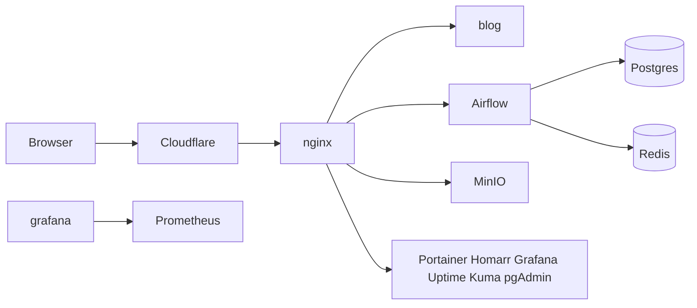

# nqtn.dev

Docker services on a VPS, with nginx as the only process on ports 80 and 443. Cloudflare proxies the domain, Let's Encrypt proves ownership through the Cloudflare DNS API, and the host firewall, fail2ban, and SSH settings sit in front of the containers.

The stacks live in [`selfhost/`](selfhost/README.md). Commands below assume you are in that directory on the server.

## Services



| URL | Service |
| --- | --- |
| https://nqtn.dev | Astro blog |
| https://airflow.nqtn.dev | Airflow |
| https://minio.nqtn.dev | MinIO console |
| https://s3.nqtn.dev | MinIO S3 API |
| https://pgadmin.nqtn.dev | pgAdmin |
| https://portainer.nqtn.dev | Portainer |
| https://homarr.nqtn.dev | Homarr start page |
| https://status.nqtn.dev | Uptime Kuma health checks |
| https://grafana.nqtn.dev | Grafana, fed by Prometheus |
| https://komga.nqtn.dev | Komga books and comics, optional |
| https://adguard.nqtn.dev | AdGuard Home, optional |
| https://flower.nqtn.dev | Celery Flower, optional |

Postgres, Redis, Prometheus, and the node exporter have no public ports. nginx is the only published service.

Use a VPS with 2 vCPU and 4 GB of RAM when Airflow is included. Ubuntu 24.04 or Debian 12. SSH key access. The domain `nqtn.dev` on Cloudflare, using Cloudflare's nameservers.

## 1. Cloudflare

In the Cloudflare dashboard for `nqtn.dev`:

1. **DNS → Records**. Add an `A` record for `@` pointing at the VPS IPv4 address, proxy on (orange cloud). Add an `A` record for `*` with the same address, proxy on. Add an `AAAA` record for each if the VPS has IPv6. Proxied wildcards work on every Cloudflare plan.
2. **SSL/TLS → Overview**. Set the mode to **Full (strict)** after the origin certificate exists (step 5). Before that, Cloudflare returns error 526, which is expected.
3. **SSL/TLS → Edge Certificates**. Turn on **Always Use HTTPS** and **Automatic HTTPS Rewrites**. Set **Minimum TLS Version** to 1.2.
4. **Security → Settings**. Turn on **Bot Fight Mode**. Leave the free managed WAF ruleset enabled.
5. **My Profile → API Tokens → Create Token**. Use the **Edit zone DNS** template and limit it to `nqtn.dev`. This token is only for certificate issuance.
6. Copy the **Zone ID** from the domain overview page. A second token, limited to the same zone with **Zone → Firewall Services → Edit**, is used later by fail2ban.

Turn on two-factor authentication for the Cloudflare account.

## 2. Put the repo on the server

```bash
sudo mkdir -p /opt/my-linux-server
sudo chown "$USER:$USER" /opt/my-linux-server
git clone <your-remote-url> /opt/my-linux-server
cd /opt/my-linux-server/selfhost
```

The scripts call `bash`, so they do not need the executable bit.

## 3. Prepare the host

This installs Docker Engine, the Compose plugin, UFW, fail2ban, and unattended security upgrades. It allows SSH plus public 80/443, and creates `/var/lib/selfhost` for your user.

```bash
sudo bash scripts/bootstrap-vps.sh
```

Log out and back in so your user joins the `docker` group.

The script opens port 22. If SSH listens on another port, change the `ufw allow` line in `scripts/bootstrap-vps.sh` and `scripts/ufw-cloudflare.sh` before you run them.

## 4. Fill in secrets

```bash
cp .env.example .env
cp networking/certbot/cloudflare.ini.example networking/certbot/cloudflare.ini
chmod 600 .env networking/certbot/cloudflare.ini
```

Edit `networking/certbot/cloudflare.ini` and set `dns_cloudflare_api_token` to the DNS token from step 1.

Edit `.env`:

- `CERTBOT_EMAIL` is a mailbox you read. Let's Encrypt uses it for expiry notices.
- Passwords are 16 or more letters and digits. Symbols break the Redis and database URLs.
- Generate the two keys on the server:

```bash
python3 -c "import base64,os; print(base64.urlsafe_b64encode(os.urandom(32)).decode())"
openssl rand -hex 32
```

Put the first value in `FERNET_KEY` and the second in `HOMARR_SECRET_ENCRYPTION_KEY`.

`selfhost/data/config/airflow.cfg` used to contain a Fernet key. That file is gone. Generate a new key. If that old file was ever pushed or copied off the machine, treat the old key as public and leave it unused.

## 5. Issue the certificate

Certbot creates a TXT record through the Cloudflare API, then stores a certificate for `nqtn.dev` and `*.nqtn.dev` in `networking/certbot/conf/`.

If this machine already has a certificate tree in `networking/nginx/ssl` (the old mount), move it instead of issuing again:

```bash
mv networking/nginx/ssl networking/certbot/conf
```

Otherwise:

```bash
bash scripts/issue-cert.sh
```

The certificate is trusted by browsers. Cloudflare checks it when the SSL mode is Full (strict).

Renewal is a daily cron entry. Use the real path of the script:

```bash
sudo crontab -e
```

```
0 3 * * * /opt/my-linux-server/selfhost/scripts/renew-cert.sh >> /var/log/cert-renew.log 2>&1
```

## 6. Start the containers

```bash
bash scripts/deploy.sh
```

That creates the `nginx-network` and `data-internal` networks, then starts nginx, the blog, Airflow, and the management stack.

On a smaller VPS, skip Airflow, Postgres, Redis, MinIO, and pgAdmin:

```bash
bash scripts/deploy.sh --without-data
```

Set Cloudflare SSL/TLS to **Full (strict)** if you have not already. Then open https://nqtn.dev.

The blog image is `s3343711/astro-blog`. If the pull is denied, run `docker login` with an account that can read that image and deploy again.

## 7. Accept web traffic only from Cloudflare

After https://nqtn.dev loads through the orange-cloud records, replace the public 80/443 rules with Cloudflare's published ranges:

```bash
sudo bash scripts/ufw-cloudflare.sh --yes
```

SSH stays open. Refresh the nginx client-IP list when you update the firewall ranges:

```bash
bash scripts/update-cloudflare-ips.sh
```

## 8. fail2ban

`bootstrap-vps.sh` already jails SSH. Four failures in ten minutes bans the address for a day. Repeat offenders are banned for a week. Add your home IP to `ignoreip` in `security/fail2ban/jail.d/selfhost.conf` before you install it, then re-run the bootstrap script so the jail file is copied again:

```bash
sudo bash scripts/bootstrap-vps.sh
```

Check it:

```bash
sudo fail2ban-client status sshd
```

HTTP bans on the VPS firewall miss the client, because the TCP connection comes from Cloudflare. The nginx jails in `selfhost.conf` send bans to the Cloudflare API instead, and they start disabled. To turn them on:

1. Create the firewall token from step 1.
2. Install the env file and restart fail2ban:

```bash
sudo cp security/fail2ban/cloudflare.env.example /etc/fail2ban/cloudflare.env
sudo chmod 600 /etc/fail2ban/cloudflare.env
sudoedit /etc/fail2ban/cloudflare.env
```

3. In `/etc/fail2ban/jail.d/selfhost.conf`, set `enabled = true` for `nginx-limit-req` and `nginx-probes`.
4. If `ROOT_DATA_PATH` is not `/var/lib/selfhost`, point `logpath` at `${ROOT_DATA_PATH}/nginx/logs/`.
5. `sudo systemctl restart fail2ban`

nginx writes the real client address only after it trusts `CF-Connecting-IP` from Cloudflare's ranges. That list is `networking/nginx/conf.d/00-cloudflare-realip.conf`.

## 9. SSH keys

From a second terminal, confirm you can log in with your key. Then:

```bash
sudo bash scripts/bootstrap-vps.sh --with-ssh-hardening
```

Keep the first session open until the second one succeeds. The drop-in disables password login and allows root only with a key. On Ubuntu, a later `PasswordAuthentication yes` in `/etc/ssh/sshd_config` overrides the drop-in. Comment that line out if password login still works, then reload SSH again.

## 10. First login

| Service | First visit |
| --- | --- |
| Portainer | Create the admin user at https://portainer.nqtn.dev. The container can see the Docker socket, so this login is root on the host. |
| Uptime Kuma | Create the admin user at https://status.nqtn.dev. Add an HTTPS monitor for each URL in the table above, interval 60 seconds. Optional Docker host: `tcp://socket-proxy:2375`. |
| Homarr | Create the admin user at https://homarr.nqtn.dev. Add the same URLs as tiles. Docker integration host `socket-proxy`, port `2375`. The socket proxy allows reads and blocks container create and delete. |
| Grafana | User and password are `GRAFANA_ADMIN_USER` and `GRAFANA_ADMIN_PASSWORD`. Prometheus is already added. Import dashboard **1860** (Node Exporter Full) and pick the Prometheus datasource. |
| pgAdmin | Email and password are `PGADMIN_DEFAULT_EMAIL` and `PGADMIN_DEFAULT_PASSWORD`. Register a server with host `postgres`, port `5432`, and the Postgres user, password, and database from `.env`. |
| MinIO | Console user is `MINIO_ROOT_USER`. API endpoint for clients is `https://s3.nqtn.dev`. Cloudflare's free plan limits a proxied request body to 100 MB. |
| Airflow | User and password are `AIRFLOW_WWW_USER_USERNAME` and `AIRFLOW_WWW_USER_PASSWORD`. Put DAG files in `data/dags`. Example DAGs are off. |
| AdGuard | Only present after `--with-adguard`. See below. |

## 11. Cloudflare Access for the admin hostnames

Application passwords stay in place. Access adds a login wall in front of them.

In **Zero Trust → Access → Applications**, add a self-hosted application for each admin hostname (`airflow`, `minio`, `pgadmin`, `portainer`, `homarr`, `grafana`, `status`, and `adguard` / `komga` / `flower` if you use them). Policy: allow your email. Leave `nqtn.dev` and `s3.nqtn.dev` without Access so the site and S3 clients keep working. S3 clients authenticate with MinIO keys.

## 12. Optional pieces

AdGuard Home, web UI only. DNS ports stay closed so the VPS is not an open resolver.

```bash
bash scripts/deploy.sh --with-adguard
```

The first start serves the setup wizard on port 3000. If https://adguard.nqtn.dev does not load, edit `networking/nginx/conf.d/55-adguard.conf`, change the upstream to `adguardhome:3000`, then:

```bash
docker exec nginx nginx -s reload
```

Finish the wizard, point the upstream back at `adguardhome:80`, and reload nginx again. For DNS on your own devices, use a VPN such as Tailscale and keep port 53 off the public interface.

Komga was on `komga.nqtn.dev` in the previous proxy config. The container is optional:

```bash
bash scripts/deploy.sh --with-komga
```

Libraries go in `/var/lib/selfhost/komga/data`. Change the volume in `media/docker-compose.yml` if the files already live somewhere else. Create the Komga admin user at https://komga.nqtn.dev and put that hostname behind Cloudflare Access.

Flower:

```bash
bash scripts/deploy.sh --with-flower
```

https://flower.nqtn.dev shows Celery workers. Put it behind Cloudflare Access with the other admin hostnames.

## 13. Operate

Stop containers and keep volumes:

```bash
bash scripts/down.sh
```

Pull a stack and recreate it. Example for the management stack:

```bash
docker compose --env-file .env -f management/docker-compose.yml pull
docker compose --env-file .env -f management/docker-compose.yml up -d
```

Bump image tags in the compose files when you mean to upgrade. Homarr, MinIO, and Komga follow `latest`. The other images are pinned. Airflow's Postgres volume is Postgres 16. A directory written by Postgres 13 has to be dumped with the old image and restored into 16.

Backup the database and the host data directory:

```bash
docker exec postgres pg_dump -U airflow airflow > "$HOME/airflow-$(date +%F).sql"
sudo tar -C /var/lib -czf "$HOME/selfhost-data-$(date +%F).tar.gz" selfhost
```

Named volumes (`postgres-db-volume`, Grafana, Portainer, Homarr, Uptime Kuma, Prometheus) live in Docker's volume directory. `pg_dump` covers the database. For the other volumes, copy them with a short-lived container, for example:

```bash
docker run --rm -v management_grafana-data:/from -v "$HOME:/backup" alpine \
  tar -C /from -czf /backup/grafana-$(date +%F).tar.gz .
```

The volume name is `<compose-project>_<volume>`. The project name is the directory (`management`, `data`).

Logs: `docker logs nginx`, `docker logs airflow-scheduler`, and files in `/var/lib/selfhost/nginx/logs/`.

## Checklist

- Cloudflare proxy is on for `@` and `*`, SSL mode is Full (strict), minimum TLS is 1.2, Bot Fight Mode is on.
- `.env` and `cloudflare.ini` are mode 600 and are not committed.
- `FERNET_KEY` and `HOMARR_SECRET_ENCRYPTION_KEY` are new values stored in a password manager.
- UFW allows SSH, and 80/443 only from Cloudflare.
- `fail2ban-client status sshd` shows the jail running. Your home IP is in `ignoreip`.
- A second SSH session works with a key after `--with-ssh-hardening`.
- Portainer, Grafana, pgAdmin, Homarr, and Uptime Kuma have their own admin users, and Cloudflare Access covers those hostnames.
- The renewal cron is installed.
- Postgres is not published on a host port. The Docker socket is mounted on Portainer only. Homarr and Uptime Kuma talk to the read-only socket proxy.
